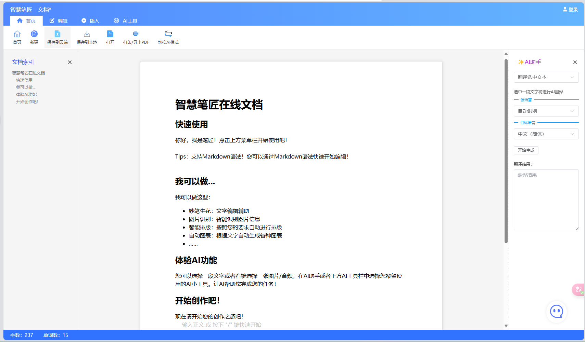

# 智慧笔匠在线文档

第十三届“中国软件杯”大学生软件设计大赛 A10 在线编辑器赛道一等奖作品

<br />

<p align="center">
  <a href="https://github.com/woziji2200/SmartScribe">
    
  </a>

  <h3 align="center">智慧笔匠在线文档</h3>
  <p align="center">
    集成百度PaddlePaddle AI技术的创新在线文档编辑器，致力于提升用户的编辑效率和文档质量。
    <br />
  </p>

  
</p>

 
## 目录

- [智慧笔匠在线文档](#智慧笔匠在线文档)
  - [目录](#目录)
    - [项目展示](#项目展示)
      - [两种编辑模式随心换](#两种编辑模式随心换)
      - [创新AI区块](#创新ai区块)
      - [任务规划系统](#任务规划系统)
    - [项目部署](#项目部署)
    - [作者](#作者)
      - [前端](#前端)
      - [后端](#后端)
    - [版权说明](#版权说明)
    - [鸣谢](#鸣谢)


### 项目展示

<video src="doc/媒体1.mp4" controls="controls"></video>

#### 两种编辑模式随心换


AI模式：


经典模式：



#### 创新AI区块

创新性融入AI区块，打破了编辑器和AI的界限，让用户可以在编辑器中直接使用AI功能，提升编辑效率。


可编辑图表，支持AI自动图表


#### 任务规划系统

原创任务时间线系统，支持一键任务规划


### 项目部署
Project setup

```bash
npm install
```

Compiles and hot-reloads for development

```bash
npm run serve
```

Compiles and minifies for production

```bash
npm run build
```


### 作者

#### 前端 


[woziji2200 (高坂滑稽果)](https://github.com/woziji2200)

[博客 高坂滑稽果的工具箱](https://www.funny233.xyz)

#### 后端


 [dx2331lxz (道宣)](https://github.com/dx2331lxz) 
 
 [博客 道宣的窝](https://daoxuan.cc/)


### 版权说明

该项目签署了MIT 授权许可，详情请参阅 [LICENSE.txt](https://github.com/shaojintian/Best_README_template/blob/master/LICENSE.txt)

### 鸣谢

使用了以下开源项目：

[hellowuxin 思维导图组件](https://github.com/hellowuxin/vue3-mindmap)

参考了 [Umo Editor](https://editor.umodoc.com/cn/docs) 的部分插件

**感谢企业方百度出题老师和软件杯组委会给予的这次机会！**
